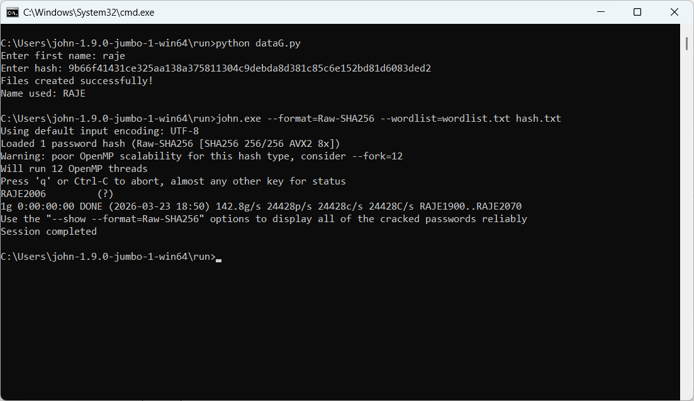

#  Password Cracking Simulation (SHA-256)
##  Overview

This project demonstrates how weak passwords can be cracked using **dictionary attacks**.
It simulates a real-world authentication system where passwords are stored as **SHA-256 hashes**.

The system generates targeted wordlists using user information and attempts to crack hashes using **John the Ripper**.

##  Features

* Generate custom wordlists (Name + Number patterns)
* Store and manage password hashes
* Perform dictionary attacks using John the Ripper
* Demonstrate weak vs strong password security

##  Tech Stack

* Python
* SHA-256 (hashing)
* John the Ripper (Jumbo Version)

##  How It Works

1. User enters:

   * First Name
   * Target Hash
2. Python script:

   * Converts name to uppercase
   * Generates combinations (e.g., RAHUL1900 → RAHUL2070)
   * Stores them in `wordlist.txt`
3. Run John the Ripper:


   john.exe --format=Raw-SHA256 --wordlist=wordlist.txt hash.txt
   ```
4. If a match is found:

   john.exe --show hash.txt
   

## 📷 Demo



## ⚠️ Disclaimer

This project is created for **educational and ethical purposes only**.
It demonstrates how weak passwords can be vulnerable to attacks and highlights the importance of strong password practices.

---

##  Author

Boya Karthik
"Simulating attacks to strengthen defenses—finding vulnerabilities before hackers do!"
